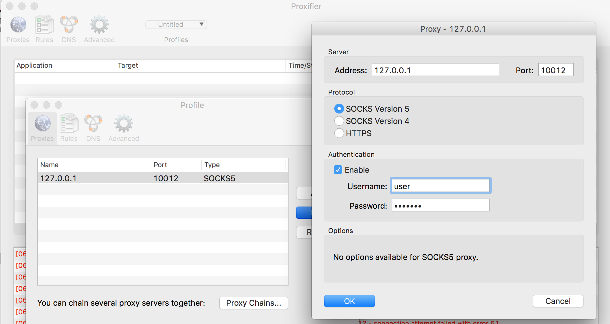

# DESC

This project implements the [Shadowsocks](https://github.com/shadowsocks/shadowsocks) protocol using python3.5 and asyncio library
 since the original project source code is unreadble and frustrated to extend.

Shadowsocks is a proxy program, that the client is listening socks5 protocol on local(socks5 connect/UDP association), 
forward encrypt socks5 data to remote proxy, and then the proxy forward the socket data to target host. It hides the SOCKS5
 handshakes and traffic bytes from censor.

Shadowsocks is mainly used for bypassing Great Firewall of China, since the data is encrypt and sent over 
normal TCP/UDP, no handshake, no fingerprint, getting away from packet inspection, it's hard to block.

# FEATURE
* shadowsocks protocol implements TCP proxy without OTA feature, no UDP
* sock5ssl implements only SOCKS CONNECT, no BIND/UDP ASSOCIATE


# INSTALLATION
## For Ubuntu 14.04
* python3

```
sudo apt-get install -y python-software-properties
sudo add-apt-repository ppa:fkrull/deadsnakes
sudo apt-get update
sudo apt-cache show python3.5
sudo apt-get install -y python3.5 python3.5-dev
sudo apt-get install python3.5-venv
sudo apt-get install python3.4-venv
```

* openssl

```shell
sudo apt-get install openssl
```

* ME

```shell
sudo pip3 install -e git+https://github.com/FTwO-O/pyShadowsocks.git@master#egg=pyshadowsocks
```

## For Mac OSX
Mac OS has a deprecated openSSL and does not includes the header files, so you need to install openSSL library manually.

* openssl
	* build openSSL manually using the [script](https://github.com/FTwO-O/Build_Mac_Command_Line_Tools/blob/master/openssl.sh) 
	* or Use brew to install openSSL
	
	```shell
	brew install openssl
	```
* ME

```shell
sudo pip3 install -U -e git+https://github.com/FTwO-O/pyShadowsocks.git@master#egg=pyshadowsocks
```

# Run it!

## For shadowsocks protocol

* proxy server

```shell
ss shadowsocks --cipher_method aes-256-cfb --password 123456 remote --listen_port 8099 &
```

* local server

```shell
ss shadowsocks --cipher_method aes-256-cfb --password 123456 local --remote_host 110.110.110.110 --remote_port 8099 &
```
   
* Mac OSX Client
With GoAgentX, you can run local server and switch SOCKS proxies at the same time, making task easier. 

1. Download [GoAgentX for Mac](https://goagentx.googlecode.com/files/GoAgentX-v2.2.9.dmg).

2. Add a shell service config (to start local socks server) and then click the ON button


* iOS Client: Shadowrocket、A.BIG.T、Surge

## For socks5ssl protocol
    
* proxy server

```shell
ss socks5ssl --user user --password 123456 remote --listen_port 9000
```
    
* local server

```shell
ss socks5ssl local --remote_host 110.110.110.110  --remote_port 9000 --socks_port 10012 & 
```

* Mac OSX Client

    Proxifier is a network tool that tuns all tcp traffic going through SOCKS proxy, it works at network driver level, transparent from applications.

1. After running the local server, config the proxifier's SOCKS setting
    
2. Setup default rule to use the SOCKS proxy, create another rule for proxy ip that  must not use proxy 
    

* iOS Client

    A.BIG.T is a iOS proxy App, supporting http/socks5/shadowsocks protocol. 
    setup a proxy config for socks5ssl with A.BIG.T: 
    


        
        
# TODO

1. ~~SOCKS5 user/password authentication~~
2. ~~SOCKS5 over SSL~~
3. ~~Remove the cryptography library, use openSSL with ctypes.~~
4. Use Apple's cryto library for Mac OS X instead of openssl
5. Filtering connections to local ip for security consideration
6. Flow control
7. Custom protocol, carry TCP/UPD/HTTP traffic
8. Multi threading/process for multiple user/port